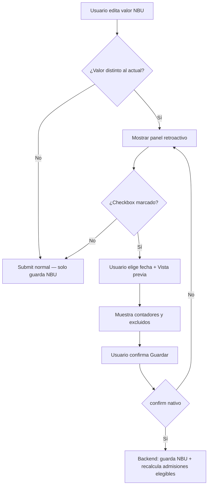

# Diseño: v1.105.0 — Inmutabilidad de precios NBU + recálculo retroactivo opcional

> Documento de diseño para **AGENTE_PROGRAMADOR** (contexto obligatorio antes de implementar).
> **Modo:** Mejora de formularios existentes (3 puntos de entrada).
> **Diseñado por:** AGENTE_DESIGNER (sesión PM 2026-05-21).
> **Insumos:** v1.105.0 acordado en planificación PM, `DESIGN_SYSTEM.md`, `lab/nomenclator/show`, `insurance/edit`, `customer/edit`.

---

## Propósito

Cuando el usuario cambia el **valor NBU** (multiplicador de precio) de una obra social, empresa laboral o veterinaria, las admisiones ya registradas **no deben modificarse automáticamente**. Opcionalmente, el usuario puede elegir **actualizar admisiones existentes desde una fecha**, con vista previa antes de confirmar.

**Usuarios:** Administrador, personal de facturación / configuración de nomencladores.

**Acción principal:** Guardar el nuevo valor NBU sin sorpresas; si hace falta alinear protocolos viejos, hacerlo de forma explícita y acotada.

---

## Reglas de negocio con impacto en UI

| Regla | Implicación de diseño |
|--------|------------------------|
| Por defecto, admisiones existentes **no cambian** | El formulario guarda el NBU nuevo sin tocar `admission_tests` / `vet_admission_tests` |
| Recálculo retroactivo es **opt-in** | Checkbox desmarcado por defecto; panel expandible solo si el valor NBU difiere del actual |
| Alcance por **fecha de admisión** (`date >= desde`) | Campo fecha visible solo con checkbox activo |
| **Excluir facturados** | Preview y ejecución omiten protocolos con `invoiceProtocols`; mostrar contador “X excluidos por ya facturados” |
| Clínico + laborales | Misma UX; backend filtra por `insurance_id` |
| Veterinarias | Misma UX en `customer/edit`; backend filtra por `customer_id` y `veterinary_nbu_value` |
| Checkbox “Recalcular precios” existente en nomenclador | **Mantener** — solo afecta filas del nomenclador (`insurance_tests`), no admisiones. Renombrar label si confunde: *“Recalcular precios del nomenclador”* |
| Auditoría | Tras aplicar retroactivo: flash con resumen + `logAudit` en el cliente/OS |

---

## Componente reutilizable — panel “Actualizar admisiones existentes”

Usar Alpine.js inline (patrón del proyecto). Nombre interno sugerido: `nbuRetroactivePanel`.

### Estados del panel

| Estado | UI |
|--------|-----|
| Valor NBU sin cambios | Panel oculto |
| Valor NBU cambió | Panel visible (`bg-amber-50 border border-amber-200 rounded-lg p-4 mt-4`) |
| Checkbox desmarcado | Solo texto explicativo + checkbox |
| Checkbox marcado | Muestra fecha + botón preview + bloque resultado |
| Preview cargando | Botón preview con spinner / “Calculando…” |
| Preview listo | Resumen numérico (ver abajo) |
| Sin admisiones elegibles | Mensaje `text-gray-600`: “No hay admisiones sin facturar desde esa fecha.” |
| Confirmación | `confirm()` nativo o modal simple antes del submit final |

### Contenido del panel (checkbox desmarcado)

```
☐ Actualizar precios de admisiones existentes
   Las admisiones ya cargadas conservan su precio actual. Marcá esta opción
   solo si querés recalcular protocolos anteriores con el nuevo valor NBU.
```

### Contenido del panel (checkbox marcado)

| Elemento | Detalle |
|----------|---------|
| Label fecha | “Actualizar admisiones desde” |
| Input | `type="date"`, default = hoy (`YYYY-MM-DD`), max = hoy |
| Botón secundario | “Vista previa” — `bg-white border border-amber-300 text-amber-800 hover:bg-amber-100` |
| Resumen preview | Caja `bg-white rounded border border-amber-100 p-3 text-sm` |

**Texto del resumen preview (ejemplo):**

```
Se actualizarían 42 admisiones (318 determinaciones).
12 admisiones facturadas quedarán sin cambios.
Diferencia estimada en totales: + $ 15.420,00
```

- Si `excluded_invoiced === 0`, omitir la línea de facturados.
- Diferencia estimada: opcional en v1; si es costoso, mostrar solo contadores (admisiones + filas).

### Submit final

- Si checkbox retroactivo **marcado**: `confirm('¿Confirmás actualizar N admisiones desde {fecha}? Esta acción no se puede deshacer.')` antes de enviar.
- Hidden fields: `retroactive_update=1`, `retroactive_from=YYYY-MM-DD`.

---

## 1. Nomenclador — `lab/nomenclator/show.blade.php`

### Contexto actual

Formulario “Valor NBU de la Obra Social” con checkbox “Recalcular precios” (nomenclador).

### Cambios propuestos

| Elemento | Actual | Propuesta |
|----------|--------|-----------|
| Checkbox recalcular nomenclador | “Recalcular precios” | “Recalcular precios del nomenclador” + tooltip `title` aclaratorio |
| Panel retroactivo | No existe | Debajo del formulario NBU, `@if($insurance->type !== 'nomenclador')` |
| Alpine | Ninguno en form NBU | `x-data="nbuRetroactivePanel({{ $insurance->nbu_value ?? 0 }})"` |

**Layout del form (fila inferior, full width):**

```
[ Valor NBU input ] [ Recalcular nomenclador ☐ ] [ Guardar ]

[ Panel retroactivo admisiones — ancho completo ]
```

**Preview API sugerida:** `POST /nomenclator/{insurance}/nbu/preview-retroactive` (JSON).

---

## 2. Obra social / laborales — `insurance/edit.blade.php`

### Contexto actual

Campo `nbu_value` en grid de edición; submit va a `insurance.update`.

### Cambios propuestos

- Envolver campo `nbu_value` + panel retroactivo en `x-data="nbuRetroactivePanel(...)"`.
- Mostrar panel solo si `$insurance->type !== 'nomenclador'`.
- Panel debajo del bloque “Ejemplo de cálculo” (o sustituir ejemplo cuando NBU cambia).
- Mismos campos hidden en submit de `insurance.update`.

**Preview API:** misma ruta preview con `insurance_id`.

---

## 3. Veterinaria — `customer/edit.blade.php`

### Contexto actual

Campo `veterinary_nbu_value` visible si `customer_type === veterinary`.

### Cambios propuestos

- Panel retroactivo debajo del input NBU veterinaria.
- Copy adaptado: “protocolos veterinarios” en lugar de “admisiones”.
- Preview filtra `vet_admissions` por `customer_id`.
- Solo visible si el cliente es veterinaria (`isVeterinary()`).

**Preview API sugerida:** `POST /customers/{customer}/veterinary-nbu/preview-retroactive`.

---

## Flujo de interacción



---

## Feedback post-acción

| Resultado | UI |
|-----------|-----|
| Solo NBU guardado | Flash verde existente: “Valor NBU actualizado correctamente.” |
| NBU + retroactivo | Flash verde: “Valor NBU actualizado. Se recalcularon 42 admisiones (318 determinaciones). 12 facturadas no se modificaron.” |
| Error validación fecha | Flash rojo inline o `@error` en campo fecha |
| Sin elegibles | Flash amarillo: “Valor NBU guardado. No había admisiones sin facturar para actualizar desde {fecha}.” |

---

## Componentes y estilos (DESIGN_SYSTEM)

- **Cards / paneles:** `rounded-xl shadow-sm border`, acento `amber-50/200` para advertencia (no destructivo).
- **Botón primario Guardar:** mantener `teal-600` (nomenclador) / `blue-600` (insurance) / existente en customer.
- **Botón preview:** secundario, borde amber.
- **Tipografía helper:** `text-xs text-gray-500` bajo inputs.
- **Icono opcional:** `bi-info-circle` junto al checkbox para tooltip.

---

## Accesibilidad

- `label` asociado a checkbox y fecha (`for=` / `id=`).
- Botón preview: `type="button"` (no submit accidental).
- Mensaje preview con `role="status"` o `aria-live="polite"` al cargar.

---

## Qué NO cambiar

- Lógica de alta de admisión (v1.104.1).
- Módulo muestras/aguas (modelo distinto).
- Checkbox “Recalcular precios del nomenclador” — comportamiento actual sobre `insurance_tests`.
- Listados de facturación / billing.

---

## Referencia visual — nomenclador (wireframe ASCII)

```
┌─────────────────────────────────────────────────────────────┐
│ Valor NBU de la Obra Social                                 │
├─────────────────────────────────────────────────────────────┤
│ Valor de 1 NBU:  [ $ 125,50    ]                            │
│ ☐ Recalcular precios del nomenclador    [ Guardar ]         │
│                                                             │
│ ┌─ Actualizar admisiones existentes ─────────────────────┐  │
│ │ ☐ Actualizar precios de admisiones existentes          │  │
│ │   Las admisiones ya cargadas conservan su precio...    │  │
│ │                                                        │  │
│ │   Desde: [ 2026-05-21 ]   [ Vista previa ]             │  │
│ │   ┌ Preview ───────────────────────────────────────┐   │  │
│ │   │ 42 admisiones · 318 determinaciones            │   │  │
│ │   │ 12 facturadas excluidas                        │   │  │
│ │   └────────────────────────────────────────────────┘   │  │
│ └────────────────────────────────────────────────────────┘  │
└─────────────────────────────────────────────────────────────┘
```

---

## Para el programador

- Implementar **servicio** compartido `NbuRetroactivePricingService` (preview + apply); la UI solo consume JSON.
- Reutilizar `AdmissionInsuranceTestPricing::resolve()` con el **nuevo** `nbu_value` inyectado (no el persistido aún en preview).
- Vet: recalcular con `VetAdmissionController::veterinaryPriceFromNbu($newRate, $nbu)`.
- Exclusión facturados: `->uninvoiced()` en Admission y VetAdmission.
- Tests Feature obligatorios (ver prompt v1.105.0).
